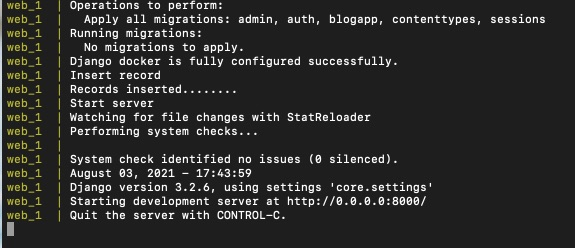
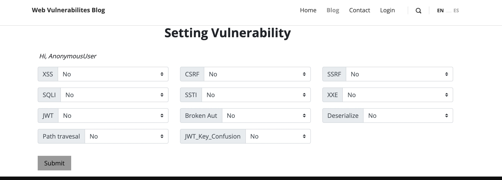

# Blog Vulnerable Web Application

Blog-vul is developed by small team as Damn vulnerable application. It is using the Django as the framewok and PSQL as a database. It main goals is to be an aid for the security learn with the vulnerability. It is developed to practice some some of the most common web vulnerabilities. we are encouraged to try and discover as many issues as possible. 


# Installation

Every data is available in the source. To running and check it. Please follow step by step as below: 

## Step 1

Clone the source

``` 
git clone https://github.com/pentestThucchienTeam/blog-vul.git

```

## Step 2

Running

```
docker-compose up --build

```
Check it running or not.




## Step 3

Go to setting endpoint and make the application 



To submiting the setting, you need to login with admin user. 

Here is the credentials. 

```
username: admin

password: 123
```
### Note

> Yes:  the application is vulnerable to attack.

> No: the vulnerability defenses attack. 


# Anything else

For anything relate to bug or a new feature. Please don't hestate to contact us. 

[Tuan Tran ](https://www.facebook.com/leiz95) 
[Tuan Anh ](https://www.facebook.com/nguyentu4nanh)
[Quyen Son ](https://www.facebook.com/S0vvn)
[Do Tuan ](https://www.facebook.com/do.thanhtuan.923)


Thanks you!!!


